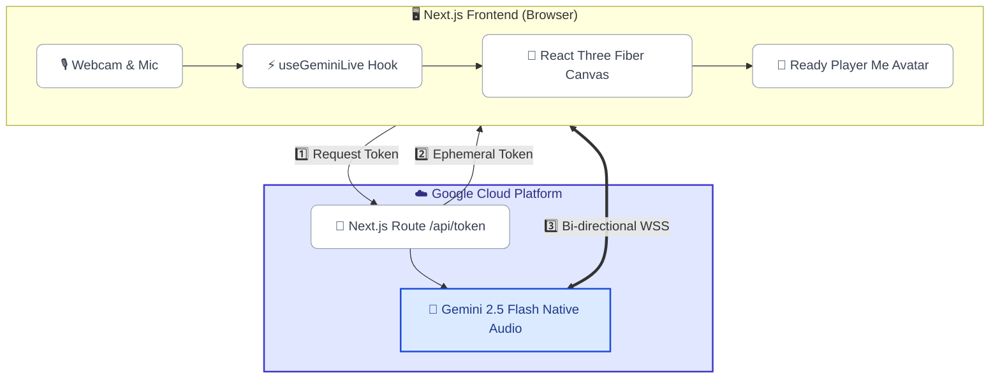
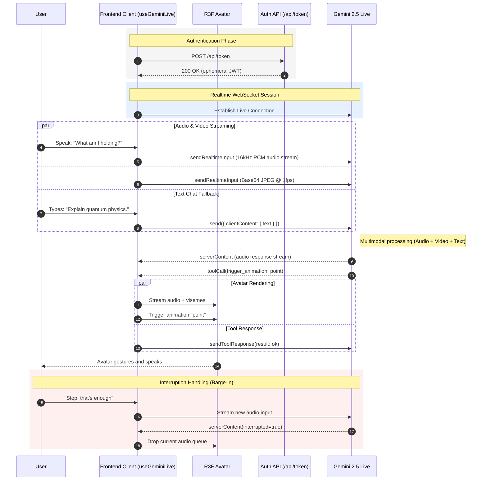

<div align="center">
  
  <h1>Digital Persona</h1>
  <p><strong>A Persistent, Emotionally Reactive 3D Avatar Powered by Gemini 2.5 Flash Native Audio.</strong></p>
    <p>
        <a href="https://github.com/Kshitijm7/digital-persona/actions/workflows/deploy.yml"></a>
        <a href="https://github.com/Kshitijm7/digital-persona/actions/workflows/ci-app.yml"></a>
        <a href="https://github.com/Kshitijm7/digital-persona/actions/workflows/deploy-pages.yml"></a>
        <a href="LICENSE"></a>
        <br>
        
        
        
        
        
        
        <br>
        
        
        
        
        
    </p>
    <p>
        <strong><a href="https://Kshitijm7.github.io/digital-persona/">📚 View Documentation Gateway</a></strong> |
        <strong><a href="https://digital-persona-798468384002.us-central1.run.app/">☁️ View Live Cloud Run App</a></strong>
    </p>
</div>

> **Bird's Eye View:** A fully embodied 3D digital instance built for the Google Gemini Live Agent Challenge. It merges the Gemini Live Multimodal API with a React Three Fiber driven Ready Player Me avatar, achieving sub-100ms conversational latency with procedural "life-like" ARKit blendshape expressions.

> [!WARNING]
> **Active Development:** This project was rapidly architected for the Gemini Live Agent Challenge and is under heavy, active development. Some configurations may break, and unstable branches exhibit experimental behaviors. Check the [issues log](https://github.com/Kshitijm7/digital-persona/issues) before deploying to production.

---

## 📖 Overview

Digital Persona is a state-of-the-art multimodal AI implementation. It doesn't simply return text — it is an **embodied entity** capable of sustaining natural face-to-face interactions. Using a Next.js 16 Client-to-Server WebSockets architecture, the avatar leverages **Google's Gemini Multimodal Live API** to hear, see, and express emotions natively.

The application uses native audio, Voice Activity Detection (barge-in), session management, and Ephemeral Tokens for secure, low-latency browser streaming.

### 💖 The Engineering Effort

We poured hundreds of hours into solving complex constraints. Traditional chatbots ping APIs — we faced the visceral challenge of translating an LLM's audio output into physical 3D behaviors in under 100 milliseconds. The result: custom real-time audio chunkers, mathematical sine-wave breathers, co-articulating lip-sync extractors, and an entirely custom "Nervous System" that links Gemini Tool Calling directly into Three.js WebGL animations. Every pixel, floating panel, and blink speed curve was obsessively tuned for maximum realism.

---

## 🚀 Key Features

### 1. Zero-Latency Conversational Architecture
- **Client-to-Server WebSockets:** Ephemeral Tokens provisioned by a Next.js backend — the frontend connects directly to Gemini for pure audio streaming, dropping the proxy overhead.
- **Seamless Barge-In (Interruption Handling):** Gemini's native Voice Activity Detection allows natural interruptions. If a user speaks over the avatar, it instantly discards audio buffers, cancels animations, and listens.
- **Session Resumption & Memory:** Maintains a 128,000-token context window; if the connection drops, it resumes the session without losing conversation history.

### 2. Emotional Intelligence & Emotive Realism
- **Affective Dialog (Emotion Awareness):** The model processes native raw audio to detect the acoustic nuances of your voice (frustration, joy, hesitation) and automatically adjusts its own spoken tone, pitch, and pace to match.
- **Co-articulation & Procedural Life:** Combines ARKit blendshapes and Oculus Visemes for smooth phoneme transitions alongside involuntary micro-twitches and respiratory breathing curves.

### 3. Deep Multimodal Awareness
- **Real-Time Vision (Webcam Streaming):** Continuously captures the user's environment via webcam (Base64 JPEG @ ~1 FPS), allowing Gemini to literally "see" you and ground answers on visual context.
- **Dual Audio/Text Transcriptions:** Real-time transcripts of both the user's spoken words and the model's generated audio are streamed and displayed simultaneously in the UI for seamless accessibility.
- **Google Search Grounding:** Gives the avatar access to the live internet to answer questions with real-time, factual accuracy while it speaks.

### 4. The Puppeteer (Tool Calling Orchestration)
- **Unified State Control:** The "Nervous System" exposes consolidated tools like `update_persona_state` and enum-locked `trigger_animation` directly over WebSocket.
- **Synchronized Physicality:** The Gemini model dynamically maps conversational intent and sentiment to ARKit expressions and gestural triggers concurrently with audio delivery.

### 5. 🎨 Extensive UI & Control Panel
A glassmorphism "Control Center" with granular runtime configurations:
- **Floating Chatbox** — Live transcript feed (user + avatar) with API debugging logs.
- **Persona Modes** — Switch the system prompt dynamically (Tutor, Therapist, Interviewer).
- **Gemini Toggles** — Enable/disable `Proactive Audio`, `Search Grounding`, and `Affective Dialog`.

---

## 🏗️ Architecture

The system uses an Ephemeral Token proxy to establish a direct, low-latency WebSocket connection to the Gemini Multimodal Live API from the browser, bypassing heavy backend routing.



### 🔄 Real-Time Interaction Sequence (VAD & Tool Calling)

This sequence illustrates the sub-100ms latency loop with native interruption handling.



---

## 🛠 Technology Stack

| Layer | Technologies |
|-------|-------------|
| **Framework** | Next.js 16 • React 19 • TypeScript • Tanstack Query |
| **3D Rendering** | Three.js • React Three Fiber • Drei • Three-stdlib |
| **AI Core** | `@google/genai` SDK • Gemini 2.5 Flash • wawa-lipsync • Phonemize |
| **Audio Pipeline** | 16-bit PCM • 16kHz mono • WebSocket streaming |
| **State Management** | Zustand • React Context |
| **UI / Styling** | Tailwind CSS v4 • Framer Motion • Radix UI • Lucide • CVA |
| **Utilities** | Pino (Structured Logging) • Sentiment • Simplex-noise • Usehooks-ts |
| **Testing** | Vitest • Testing Library • Happy DOM • JSDOM |
| **Deployment** | Docker • Cloud Run • GitHub Actions • GitHub Pages |
| **Documentation** | VitePress • Mermaid |

---

## ⚙️ Getting Started

### Prerequisites

- **Node.js** v20 or later
- A **Google Cloud Project** with the Gemini API enabled
- A `GEMINI_API_KEY` ([get one here](https://aistudio.google.com/apikey))

### Installation

```bash
git clone https://github.com/Kshitijm7/digital-persona.git
cd digital-persona
npm install
```

### Configuration

Create a `.env.local` file in the project root:

```env
GEMINI_API_KEY=your_gemini_api_key_here

# Logging (local/dev)
LOG_LEVEL_DEV=debug
NEXT_PUBLIC_LOG_LEVEL_DEV=debug

# Optional generic overrides
# LOG_LEVEL=debug
# NEXT_PUBLIC_LOG_LEVEL=debug

# Production controls (used in deploy pipeline)
# DISABLE_LOGS_IN_PROD=true
# LOG_LEVEL_PROD=silent
# NEXT_PUBLIC_LOG_LEVEL_PROD=silent
```

### Running Locally

```bash
# Validate the avatar model and animations
npm run setup-avatar

# Start the development server
npm run dev
```

Navigate to [http://localhost:3000](http://localhost:3000). Grant **Microphone & Camera** permissions when prompted.

### Available Scripts

| Script | Description |
|--------|-------------|
| `npm run dev` | Start development server |
| `npm run build` | Production build |
| `npm run lint` | Run ESLint |
| `npm run typecheck` | TypeScript type checking |
| `npm run test:run` | Run test suite |
| `npm run preflight` | Lint → Typecheck → Test → Build (full CI locally) |
| `npm run docs:build` | Build VitePress documentation |
| `npm run health-check` | Pre-deploy system validation |

---

## 🐳 Docker Deployment

The app ships with a multi-stage Dockerfile optimized for Cloud Run:

```bash
# Build the image
docker build -t digital-persona .

# Run locally
docker run -p 8080:8080 -e GEMINI_API_KEY=your_key digital-persona
```

The CI/CD pipeline automatically builds, pushes to Artifact Registry, and deploys to Cloud Run on every push to `main`.

---

## 📂 Project Structure

```
digital-persona/
├── src/
│   ├── app/           # Next.js pages and API routes
│   ├── components/    # React & Three.js components
│   ├── hooks/         # Custom hooks (useGeminiLive, useWebcam, etc.)
│   ├── store/         # Zustand stores (lip-sync, emotion, animation)
│   ├── lib/           # Constants, utilities, and shared logic
│   └── config/        # Runtime configuration
├── public/            # Avatar .glb, animations, and static assets
├── docs/              # VitePress documentation site
├── scripts/           # Automation (avatar validation, animation download)
└── project_docs/      # Internal architecture documents
```

> [!NOTE] 
> See the individual subdirectory `README.md` files for detailed internal documentation.

---

## 🤝 Contributing

Contributions are welcome! Please:

1. Fork the repository
2. Create a feature branch (`git checkout -b feature/my-feature`)
3. Make your changes and add tests
4. Run the preflight check: `npm run preflight`
5. Submit a Pull Request

See the [issues log](https://github.com/Kshitijm7/digital-persona/issues) for areas where help is needed.

---

## 📄 License

This project is licensed under the **Apache License 2.0** — see the [LICENSE](LICENSE) file for details.

---

<div align="center">
  <sub>Built with ❤️ by <a href="https://github.com/Kshitijm7">Kshitij Mittal</a> with the Google Gemini Live API</sub>
</div>
