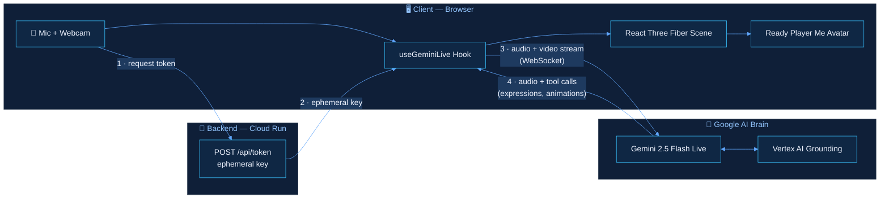
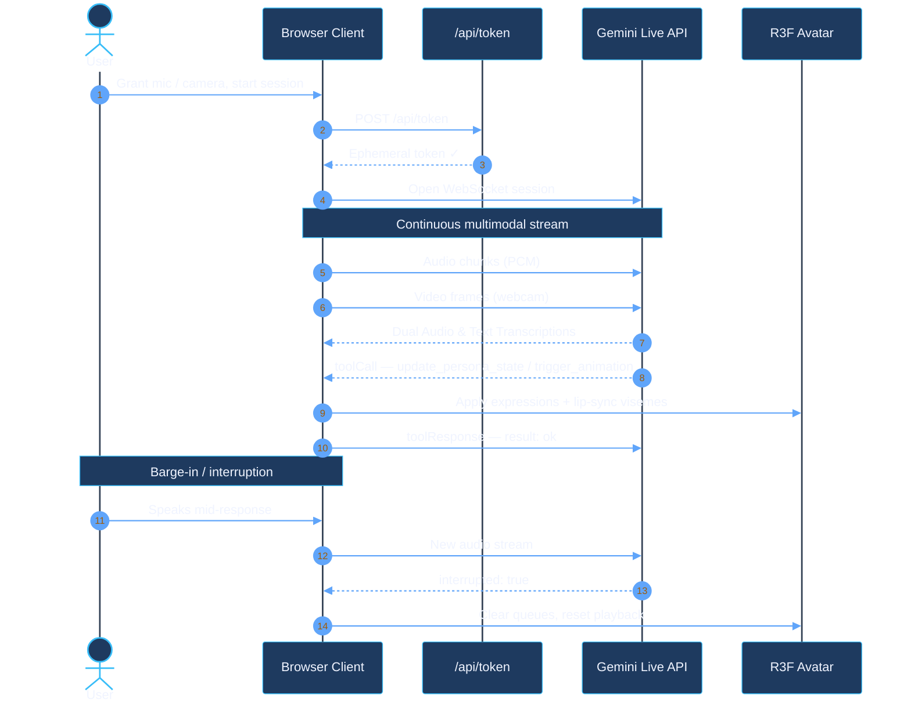

# Architecture & Secure Cloud Infrastructure

Reviewing technical architecture can sometimes feel like stepping into a maze of jargon, but understanding how data flows and how these systems connect is crucial for building trust. When we designed Digital Persona, we prioritized a seamless, secure, and lightning-fast connection between the user and the AI.

## The High-Level Topology

Our system is divided into three main layers: the client (your browser), the secure backend API, and the Google AI Brain. Each layer has a clear responsibility, ensuring that voice and video never travel through unnecessary bottlenecks.

## How Real-Time Interaction Actually Works

When you grant microphone and camera access, your client securely requests an ephemeral token. We use this token strategy specifically to protect your credentials—ensuring that your session is private and short-lived.

Once connected, audio and video are streamed directly to the Gemini Live API via WebSockets. It is this direct connection that minimizes delay while utilizing Affective Dialog to understand emotional subtleties. When the AI speaks, it sends back both the generated audio and precise tool calls. These tool calls are instructions for the React Three Fiber avatar, telling it exactly when to smile, when to gesture, and how to move its lips in perfect harmony with the spoken words using the unified `update_persona_state` and `trigger_animation` tools.

## Why We Chose This Approach

Users lose trust the moment an AI lags or stares blankly. By establishing a direct WebSocket stream, we eliminate the conversational delay that plagues older text-to-speech systems, making interactions feel genuinely human.

The primary service is hosted securely on Google Cloud Run, providing the scalable, reliable backbone required to support consistent, world-class interactions.

You can explore our live environment here: [digital-persona-798468384002.us-central1.run.app](https://digital-persona-798468384002.us-central1.run.app/)
