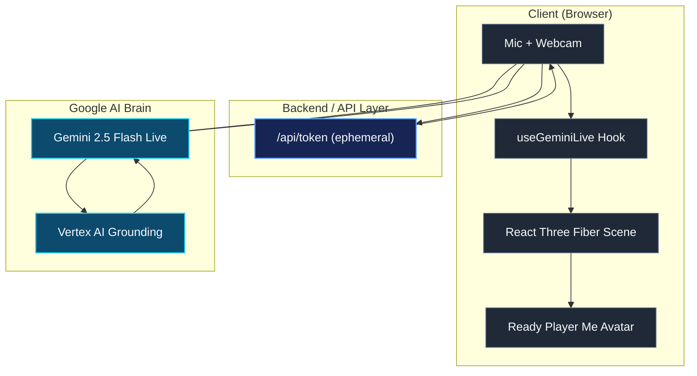
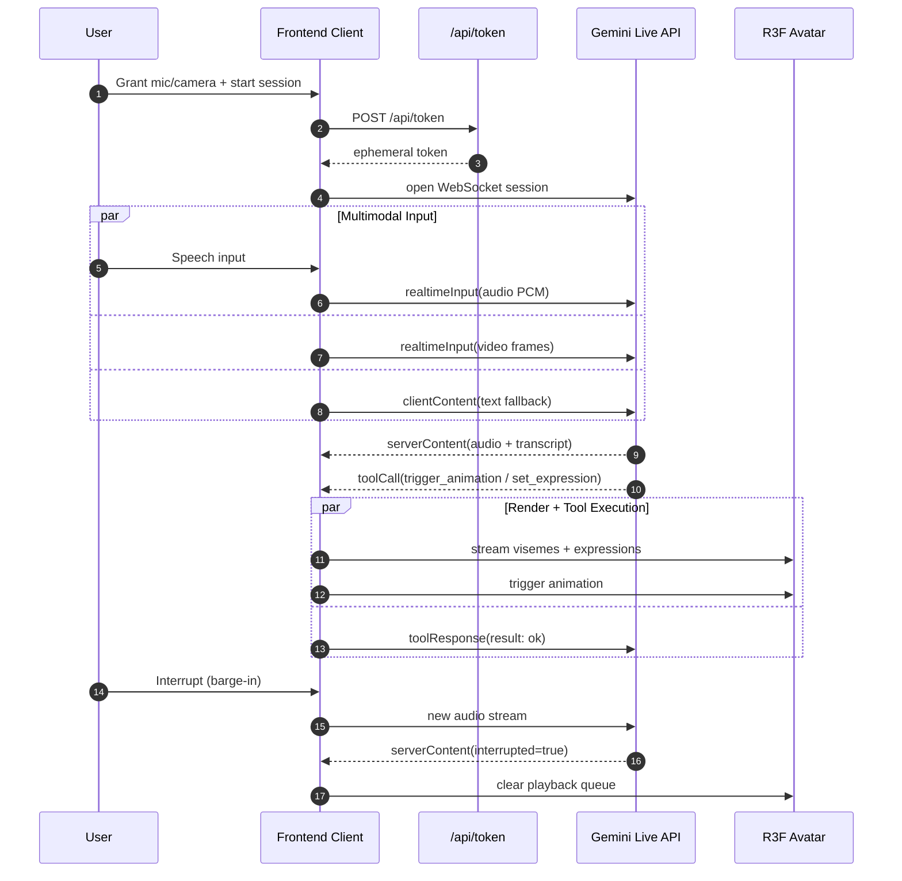

# Architecture & Secure Cloud Infrastructure

I know that reviewing technical architecture can sometimes feel like stepping into a maze of jargon. But understanding how your data flows and how these systems connect is crucial for building trust. When we designed Digital Persona, we prioritized a seamless, secure, and lightning-fast connection between you and the AI.

## The High-Level Topology

Our system is divided into three main areas: the client (your browser), the secure backend API, and the Google AI Brain. We designed it this way to ensure that your voice and video never have to travel through unnecessary bottlenecks.

## How Real-Time Interaction Actually Works

When you grant microphone and camera access, your client securely requests an ephemeral token. We use this token strategy specifically to protect your credentials—ensuring that your session is private and short-lived. 

Once connected, your audio and video are streamed directly to the Gemini Live API via WebSockets. It is this direct connection that minimizes delay. When the AI speaks, it sends back both the audio and precise tool calls. These tool calls are instructions for the React Three Fiber avatar, telling it exactly when to smile, when to gesture, and how to move its lips in perfect harmony with the spoken words.

## Why We Chose This Approach

In our experience, users lose trust the moment an AI lags or stares blankly. By establishing a direct stream, we eliminate the conversational delay that plagues older text-to-speech systems. Your interactions feel human. 

Furthermore, we host the primary service securely on Google Cloud Run. We rely on Google Cloud's proven infrastructure because it provides the scalable, reliable backbone required to support consistent, world-class interactions. 

You can explore our live environment here: [digital-persona-798468384002.us-central1.run.app](https://digital-persona-798468384002.us-central1.run.app/)
