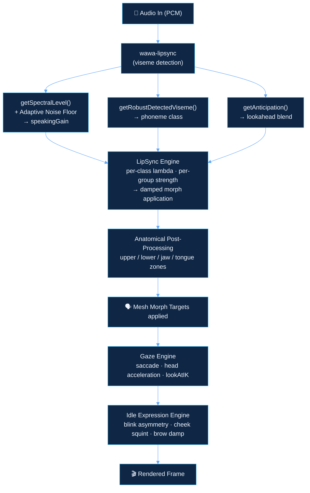

# Achieving Avatar Realism

When we first connected the avatar to the Gemini Live API, it spoke. The words were right. The intelligence was there. But the mouth was wrong.

It was a subtle wrongness—the kind a viewer can feel without being able to name it. The lips would snap from one position to the next. During pauses, the jaw would hover slightly open. The eyelids never moved. It felt like a ventriloquist's dummy: technically speaking, but fundamentally not *alive*.

Everything you see below is our answer to that problem.

---


## The Problem with Naive Lipsync

Off-the-shelf lipsync libraries detect phonemes in the incoming audio and map them directly to viseme morph targets on the 3D mesh. It works. But "works" is not the same as "looks real."

Three things made our naive implementation feel artificial:

1.  **The mouth was always late.** Moving lips in response to audio that has already been played means the mouth visually catches up to words it should have arrived at simultaneously.
2.  **Silence produced a frozen face.** A fixed noise floor would cut out too early or too late, leaving the jaw hanging in whatever position the last phoneme left it in.
3.  **Every phoneme got equal weight.** A plosive like *P* or *B* demands a sharp, fast closure. A sustained vowel like *ahh* should melt in slowly. Treating them identically erases the natural rhythm of speech.

These aren't edge cases. They are the entire difference between a rendered face and a person.

---

## 1. Viseme Anticipation: Seeing Just Ahead

The human brain does not hear a phoneme and *then* move the face. The nervous system anticipates upcoming sounds. Lips begin forming a vowel before the vocal cords produce it.

We replicated this with a **lookahead queue**. Every incoming audio chunk schedules future visemes into a pending queue. On every animation frame, we peek 65 ms into that queue and ask: what is coming next?

```
getAnticipation(clockMs, activeViseme, tuning)
  → { viseme: nextViseme, weight: 0–0.24 }

stabilizedActiveWeight = activeWeight − anticipationWeight
```

The upcoming viseme is blended in at up to **24%** of full strength while the current viseme is simultaneously reduced by the same amount. The total blend never exceeds 1.0, so no mesh artifacts appear—but the transition begins *before* the phoneme arrives. The "late mouth" is eliminated.

---

## 2. Adaptive Noise Floor: Knowing When Silence Is Actually Silence

Every audio capture session has a different ambient noise level. A fixed cutoff—*"if the audio level drops below 0.03, close the mouth"*—will thrash during quiet speech in a noisy room and will leave the mouth frozen during a genuine pause in a silent studio.

We replaced the fixed cutoff with a **dynamic tracking system** that measures its own environment:

```
noiseFloorAdaptLambda: 2.6    ← fast attack (adapts to silence quickly)
noiseFloorReleaseLambda: 0.55 ← slow release (ignores brief breath pauses)
noiseFloorMin: 0.006
noiseFloorMax: 0.08
```

The system also reads from the analyser's **frequency domain** rather than the raw waveform, which gives a far more stable continuous signal that is less sensitive to transient spikes.

The result: the mouth closes during genuine silence and stays open during soft, trailing syllables—exactly the way a human mouth does.

---

## 3. Anatomy-Aware Post-Processing: The Face Is Not a Flat Surface

A 3D face has distinct anatomical zones. The lower face—lips, jaw, chin—moves constantly and expressively during speech. The upper face—brow, forehead—changes slowly and carries emotional weight. Treating all morph targets as one undifferentiated pool produces a rubbery, unnatural quality.

We apply two layered post-processing stages after the raw viseme blend is calculated.

**Regional (Anatomical) Zones:**

The face is divided into upper and lower regions. Lower-face morphs (jaw open, lip stretch, lip corner) are amplified by a factor of 1.3, independently from brow and forehead. The tongue blends get their own multiplier. This means speaking looks *physical*—your can see the jaw working, not just pixels moving.

**Mesh (Skin) Smoothing:**

Upper-face morphs interpolate with a slower time constant than lower-face morphs. The forehead has natural inertia; the lips do not. We also correct for a common avatar mesh artifact—a slightly open resting lip gap—using a `lipOpenOffset` that closes the mouth to the correct anatomical rest position.

---

## 4. Per-Phoneme Lambda Tuning: Every Sound Has Its Own Rhythm

In the original implementation, every viseme transitioned at the same speed. We replaced that with a **per-phoneme-class lambda table**:

| Phoneme Class | Lambda | Character |
|---|---|---|
| Plosives (P, B, M) | 34 | Fast snap — bilabial closure is physically quick |
| Fricatives (F, V, S, Z) | 24 | Sustained — teeth and lips hold position |
| Vowels (A, E, I, O, U) | 18 | Slow melt — vowel shapes are gradual |
| Silence | 16 | Slow return — the jaw doesn't slam shut |

We also tune the **minimum switch time** per class to prevent flickering between rapid consecutive consonants—a problem that produces a mechanical, stuttering quality in fast speech.

---

## 5. Per-Viseme Strength Overrides: Calibrating for the Mesh

Ready Player Me avatars are expressive, but their morph target ranges are not always matched to the intensity of natural speech. Some visemes under-express by default; others are exaggerated on certain meshes.

We expose a strength scaling system per viseme group:

```
strengthBMP: 120   ← Bilabials amplified 20%
strengthWOo: 150   ← Rounded vowels amplified 50%
strengthFV:  100   ← Labiodentals at baseline
```

This allows the same engine to produce natural results across different avatar meshes without re-tuning the core animation logic.

---

## 6. The Gaze Engine: Where the Eyes Actually Look

Eyes are disproportionately important to believability. A face that speaks with perfect lipsync but stares at a fixed point in space still feels dead.

We built a gaze engine that handles two separate systems:

**Saccades:** The eyes are never truly still during natural attention. We apply Simplex noise to the eye bones to simulate micro-movements, with a tunable amplitude. These small drifts make the avatar feel like it is *actively looking* rather than having its eyes parked.

**Acceleration-Limited Head Motion:** Heads do not teleport. When the idle head motion target changes, we cap the frame-to-frame rotation delta using a configurable acceleration limit. The head *arrives* at a new position; it does not snap.

**Look-At IK:** When direct eye contact is desired, a `lookAtIK` mode forces the eye bones to track the camera position each frame—overriding the procedural saccade for a more intense, locked-in sense of engagement.

---

## 7. The Idle Expression Engine: Blinking Like a Person

Blinking is invisible when done correctly and immediately noticeable when done wrong. Metronome-regular blinks—equal intervals, equal duration—read as mechanical within seconds.

Our blink system has three layers of naturalism:

**Asymmetric timing:** The eyelid closes in 45% of the blink duration and opens in 55%. This matches the anatomy of the orbicularis oculi muscle, which closes faster than it opens.

**Jitter:** The interval between blinks is randomized around a mean, so no two blinks arrive at predictable times.

**Cheek squint:** Perhaps the detail missed by most avatar systems—we add a subtle `cheekSquintLeft` and `cheekSquintRight` morph at 30% of blink weight during every blink. The cheek rises slightly when the eyelid closes. This is what makes a blink feel like something a face is *doing* rather than a texture flipping.

All brow and lid morphs are passed through exponential damping (`THREE.MathUtils.damp`) with per-morph lambda values. Nothing snaps. Everything eases.

---

## How It All Comes Together

Every frame, these systems compose in a specific order:



The avatar you see is the result of every one of these layers running in parallel, 60 times per second.

---

## The Vision for Digital Presence

The realism system is live, but it is only the foundation. We are building toward a future where the Digital Persona isn't just a talking head, but a fully autonomous companion with native agency and unique identity.

### Toward Native Agency

*   **Agentic Computer Use:** Integrating features where the persona can interpret its own display, interact with the desktop environment, and perform tasks across the operating system—moving from a chatter to a partner.
*   **Persistent Memory:** Implementing a locally-stored memory layer so your persona develops history, remembers past nuances, and adapts to your specific workflow without compromising privacy.
*   **Multimodal Concurrency:** Optimizing the pipeline to handle simultaneous streams of audio, video, and screen data with near-zero latency, enabling the persona to "see" what you see in real-time.

### Defining Unique Identity

*   **DNA-Based Generation:** Moving beyond presets to a biological-base generation system. By inputting unique parameters, users can generate a one-of-a-kind digital identity that is mathematically distinct.
*   **Dynamic Aesthetic Evolution:** A real-time engine for skin and facial modification, allowing the avatar to adapt or match specific human identities with hyper-realistic precision.
*   **Bio-Mechanical Precision:** Driving jaw and lip movement directly from raw audio energy while carrying complex phoneme residuals for a more fluid, organic speech rhythm.

### Expansive Presence

*   **Emotional Synchrony:** Mapping subtle facial micro-expressions—like inner-brow raises during stressed vowels—to bridge the final gap between synthetic and sentient.
*   **Universal Canvas:** Expanding the visual output to support AR, VR, and holographic displays, bringing the persona out of the browser and into the physical environment.

---

*Explore the realtime voice and video pipeline that feeds this system: [The Brain Behind the Avatar →](/gemini-live-api)*

*Review the secure cloud infrastructure that keeps it all running: [Architecture & Cloud →](/architecture)*
