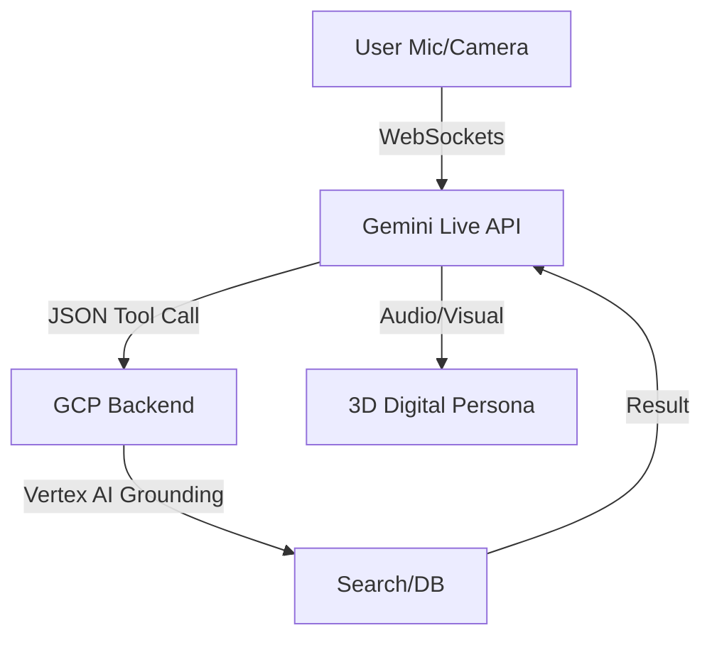

To build a standout GitHub Pages website for your open-source project submission, you should adopt a modern JAMstack architecture. This means moving beyond basic static hosting to a highly optimized, accessible, and automated deployment pipeline. 

Here is a detailed best-practice guide on how to structure your site, what pages to include, and how to implement modern web standards to impress the judges.

### 1. Recommended Page Structure
To make it easy for judges to evaluate your submission, use a "single feature per folder" directory structure or logically separated Markdown/HTML files. 

*   **Home Page (`index.md` / `index.html`)**: This is your landing page. Put your **📹 Demonstration Video** and your project pitch here. Immediately communicate the problem you solved and the value your solution brings.
*   **Project Overview (`/description/index.md`)**: House your **📃 Text Description** here. Break it down using semantic subheadings for features, technologies used, data sources, and your findings/learnings.
*   **Architecture & Cloud (`/architecture/index.md`)**: Dedicate a page to your **🏗️ Architecture Diagram** and **🖥️ Proof of Google Cloud Deployment**. Include your GCP screen recording or link directly to your Vertex AI backend code here. 
*   **Code & Reproducibility (`/repository/index.md`)**: Provide the **👨‍💻 URL to your Public Code Repository**. You can also mirror your README's spin-up instructions here to ensure judges can easily verify reproducibility.

### 2. The 2026 Approach: Best Practices & Proper Structure
To build a "best standard" website, leverage continuous integration, strict accessibility, and performance optimization:

*   **Custom GitHub Actions Deployment:** Instead of relying on the default Jekyll build process, use a custom GitHub Actions workflow to publish your site. By using `actions/upload-pages-artifact` and `actions/deploy-pages`, you can completely control your build environment, use any modern framework (like Next.js or Astro), and prevent broken code from being pushed to production.
*   **Semantic HTML Layouts:** Structure your pages using semantic HTML elements (`<header>`, `<nav>`, `<main>`, `<section>`, `<article>`, and `<footer>`) rather than generic `<div>` tags. This gives your page built-in keyboard navigation behavior, provides implicit ARIA roles for screen readers, and massively boosts your SEO. Ensure you only have one visible `<main>` tag per page.
*   **Automated Performance Optimization:** Use GitHub Actions to automatically optimize your assets. Integrate tools like the **Image Optimizer Action** to losslessly compress images and convert them into modern formats like WebP or AVIF. You can also use the **Pages Minify** action to minify your HTML, CSS, and JS.
*   **Lighthouse CI:** Add the **Lighthouse CI Action** to your workflow. This automatically audits your site on every pull request, ensuring your site maintains high performance, accessibility (a11y), and SEO scores before changes are ever merged.
*   **Version Control & Conventional Commits:** Maintain a clean, professional project history by using Conventional Commits (e.g., `feat:`, `fix:`, `docs:`). This allows you to automatically generate changelogs and demonstrates professional engineering practices to the judges.

### 3. Representing Media and Diagrams
Presenting your multimodal features, videos, and diagrams correctly is critical for an impactful pitch. 

*   **Images:** Embed images using the standard Markdown format: ``. Ensure your alt text is highly descriptive (e.g., "Screenshot of...") and expresses the core idea of the image rather than just describing it literally. This is a crucial accessibility standard.
*   **YouTube Demonstration Video:** 
    *   *(Note: The provided sources state that videos reinforce text well but do not detail the exact embedding code. The following relies on standard web practices outside of the provided sources).* 
    *   To embed a YouTube video into a GitHub Pages site, use the raw HTML `<iframe>` embed code provided by YouTube directly inside your Markdown or HTML file. Wrap the iframe in a semantic `<section>` or `<figure>` tag, and ensure the iframe includes a descriptive `title` attribute (e.g., `title="Demonstration of multimodal agentic features"`) for accessibility.
*   **Architecture Diagrams (Mermaid.js):** 
    *   *(Note: Explicit instructions for Mermaid.js are not covered in the provided sources, so the following relies on external knowledge).* 
    *   GitHub natively supports Mermaid diagrams in standard Markdown using fenced code blocks (````mermaid ````). However, if you are rendering a GitHub Pages site using standard HTML or Jekyll, you will need to include the Mermaid.js library via a CDN in your site's `<head>` or before the closing `</body>` tag, and initialize it. Alternatively, you can generate a high-quality SVG/PNG of your Mermaid graph and embed it as an optimized image, which guarantees it will load quickly and consistently for the judges. 

### 4. Accessibility & Polish
Treat your website as the front door to your project. Make sure your links are descriptive—avoid writing "click here" and instead use descriptive text like "View the GCP backend deployment code". Use plain language to describe your features, and while emojis are great for structure, avoid replacing actual bullet points with them, as it breaks screen-reader navigation.

To build a standard-setting project website in 2026, you should focus on a **"Documentation-as-Product"** approach. For an open-source project, your GitHub Pages site should not just list information but provide a high-fidelity, interactive experience for both judges and potential contributors.

### 1. Recommended Site Structure & Pages

A 2026-standard project site should move beyond a single README. Create a multi-page structure using a framework like **Docusaurus**, **Next.js**, or **Astro** for the best performance and UI.

* **Landing Page (The Pitch):**
* **Hero Section:** High-impact "Bird's Eye View" pitch (max 200 chars).
* **Core Value Props:** 3-4 feature cards solving specific problems.
* **Featured Video:** The <4-minute Demo Video (embed details below).


* **"The Architecture" Page:**
* Contain the **Architecture Diagram** as a high-res image and a Mermaid live-graph.
* Detailed breakdown of the frontend (Next.js/Three.js), backend (Google Cloud), and AI (Gemini Live API).


* **"Technical Deep Dive" Page:**
* **Technologies Used:** A "Stack List" with icons (GCP, Vertex AI, React, etc.).
* **Findings & Learnings:** A section dedicated to the "Aha!" moments and hurdles overcome.
* **Data Sources:** Citations for any datasets or external APIs used.


* **"Deployment & Reproducibility" Page:**
* **Proof of Cloud Deployment:** The screen recording showing GCP logs/console.
* **Spin-up Instructions:** Clear, copy-pasteable CLI commands to clone and run the repo.


* **"The Code" Page:**
* A direct link to the **Public Repository**.
* Key code snippets showing direct calls to Vertex AI or your agent logic.


---

### 2. Best Practices for Media & Diagrams (2026 Standards)

#### **Mermaid Graphs (Architecture & Workflows)**

Static diagrams are outdated. 2026 standards favor **dynamic, theme-aware diagrams**.

* **How to show:** Use Mermaid directly in your Markdown. Most modern static site generators have built-in support.
* **Code Example:**



* **Design Tip:** Use the `theme: 'dark'` or `'neutral'` parameter to ensure it matches your site's color scheme.

#### **YouTube Video Embeds**

Don't just paste a link; use a responsive wrapper to ensure it looks good on mobile.

* **2026 Approach:** Use the `www.youtube-nocookie.com` domain for better privacy and faster load times.
* **Pro Implementation:**
```html
<div style="position: relative; padding-bottom: 56.25%; height: 0;">
  <iframe 
    style="position: absolute; top: 0; left: 0; width: 100%; height: 100%;" 
    src="https://www.youtube-nocookie.com/embed/YOUR_VIDEO_ID" 
    frameborder="0" allow="accelerometer; autoplay; clipboard-write; encrypted-media; gyroscope; picture-in-picture" 
    allowfullscreen>
  </iframe>
</div>

```


#### **Image Representation**

* **Architecture Diagrams:** Don't just upload a screenshot. Use **SVG** format for your diagram. This keeps it crisp at any zoom level and is searchable by text.
* **Image Carousel:** For the architecture and GCP proof, use an interactive image carousel (like `shadcn/ui` components) so judges can toggle between "High Level" and "Technical Deep Dive."

---

### 3. Representing "Proof of Deployment"

Judges look for **verifiable evidence**.

* **Recording:** Embed the short recording (as a `.mp4` or link) directly under the "Deployment" section.
* **Grounding:** Below the video, provide a **direct link to a specific line of code** in your GitHub repo that shows the Vertex AI endpoint configuration or GCP service authentication. This is the ultimate "proof" for a technical judge.

### 4. Design Guidelines for 2026

* **Accessibility First:** Ensure your site passes **WCAG 2.1** tests. Use high contrast, alt-text for all diagrams, and keyboard-navigable menus.
* **Dark Mode by Default:** Modern developer tools and AI projects almost exclusively use dark-themed "Midnight" or "Obsidian" styles.
* **Minimalist Layout:** Use plenty of white space (or "dark space") and focus on typography. The goal is to make the technical content the hero.